# 아나콘다 설치
아나콘다는 파이썬 개발 환경과 데이터 분석과 머신러닝/딥러닝 모델을 구현하는 데 필요한 라이브러리 대부분을 포함하는 배포판입니다. 여기에서는 윈도우와 macOS 기준으로 아나콘다를 설치하고 사용하는 방법을 자세히 소개합니다.

## 윈도우
**01** [Anaconda 연도.숫자 for Windows Installer](https://www.anaconda.com/distribution/#download-section)에 접속합니다. 왼쪽 `[Python 3.x version]`에 있는 `<download>`를 눌러 아나콘다 설치 파일을 다운로드합니다.

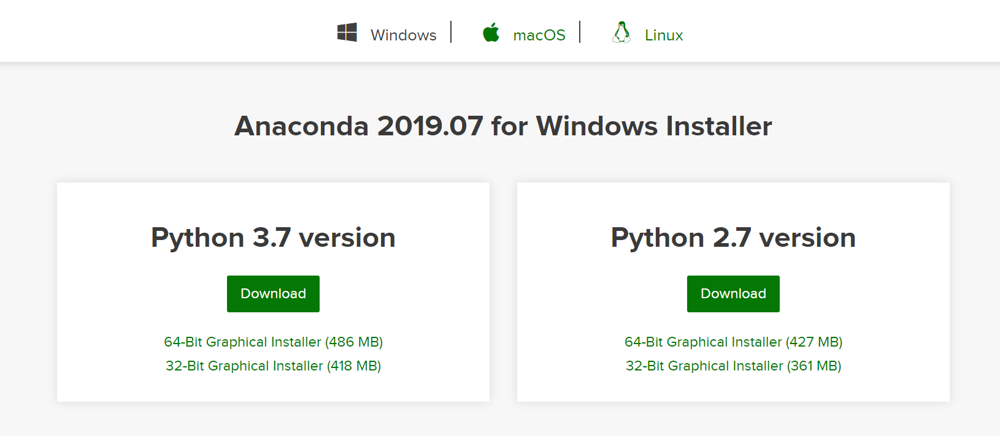

윈도우 64비트를 사용한다면 `[64-bit Graphical Installer]`를 선택해 다운로드해도 괜찮습니다. 윈도우 32비트를 사용한다면 `[32-bit Graphical Installer]`를 선택해 다운로드해도 괜찮습니다.

**02** 다운로드한 Anaconda3-연도.숫자-Windows-x86_64.exe 파일을 실행합니다. 처음 등장하는 창은 아나콘다 설치 전 주의해야 할 사항을 간략하게 소개합니다. 설치 전 다른 애플리케이션을 실행하지 않고 설치하면 컴퓨터를 재부팅하지 않고도 관련 시스템 파일을 업데이트할 수 있다는 사항을 소개합니다. `<Next>` 버튼을 누릅니다.

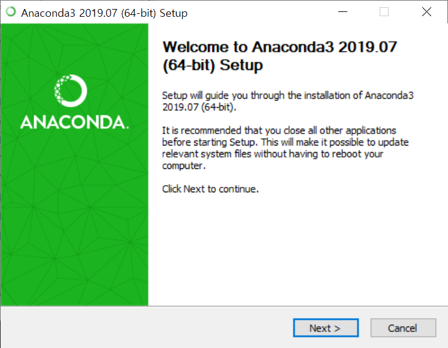

**03** 아나콘다의 라이선스 조항에 동의할 것이냐는 창이 등장합니다. 당연히 해당 조항에 동의해야 아나콘다를 사용할 수 있습니다. 시간이 된다면 스크롤창에 있는 아나콘다 라이선스 조항을 읽어보기 바랍니다. `<I Agree>` 버튼을 누릅니다.

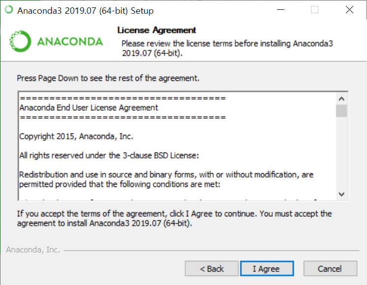

**04** 아나콘다 사용자의 범위를 지정합니다. `[Just Me]`는 현재 로그인한 윈도우 사용자만 아나콘다를 사용하도록 설정합니다. 아나콘다의 권장 사항입니다. `[All Users]`는 윈도우에 등록한 모든 사용자가 아나콘다를 사용하도록 설정합니다. 해당 설정을 지정해서 설치하려면 현재 로그인한 윈도우 사용자에게 관리자 권한이 있어야 합니다. 원하는 설정을 지정한 후 `<Next>` 버튼을 누릅니다.

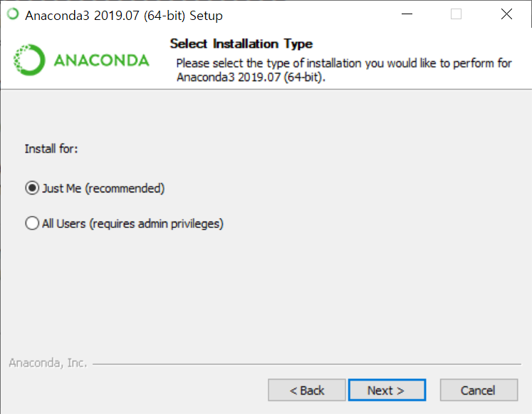

**05** 아나콘다를 설치할 폴더를 지정합니다. 사용자가 특별하게 원하는 폴더가 없다면 기본 설정 폴더 그대로 두고 설치합니다. 아나콘다를 설치하는 폴더가 위치한 하드 디스크 파티션에는 2.9GB 이상의 여유 공간이 있어야 한다는 사실을 기억하기 바랍니다.

만약 다른 폴더에 설치하고 싶다면 `[Destination Folder]`에 사용자가 원하는 폴더 경로를 입력합니다. 

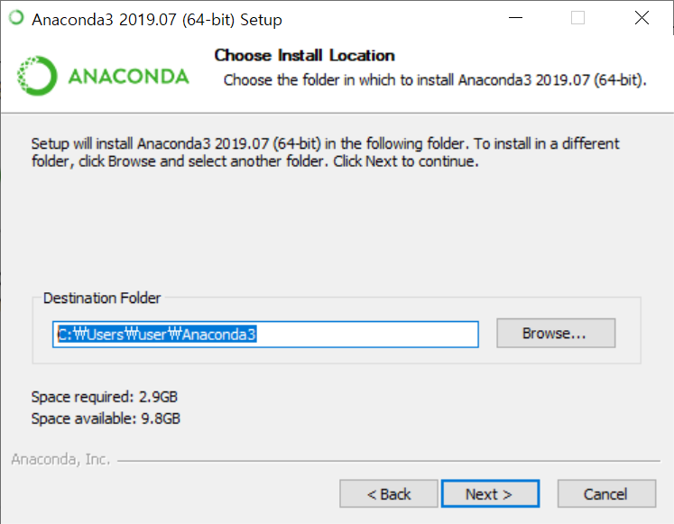

아니면 `<Browse>` 버튼을 누른 후 열리는 '폴더 찾아보기' 창에서 원하는 폴더 경로를 선택해도 됩니다. 원하는 폴더를 미리 만들지 않았다면 `<새 폴더 만들기>` 버튼을 눌러서 폴더를 생성할 수 있습니다.

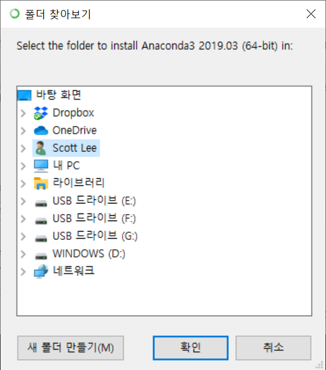

설치 폴더를 지정했다면 `<Next>` 버튼을 누릅니다. 만약 지정한 폴더에 공백이 있다면 다음 그림과 같은 메시지가 등장합니다. 이는 오류 발생의 원인이 될 수도 있으니 설치 폴더 이름에 공백이 없도록 지정한 후 설치하기 바랍니다.

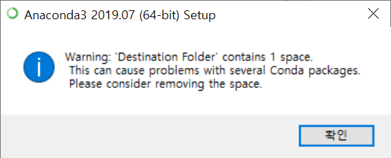

**06** 윈도우에서 아나콘다를 어떻게 사용할 수 있을지를 지정합니다.

`[Add Anaconda to my PATH environment variable]`는 윈도우 PATH 환경 변수에 아나콘다 실행 파일을 추가하는 것입니다. 아나콘다에서는 `[시작] > [Anaconda] > [Anaconda (64-bit)] > [Anaconda Prompt]` 혹은 `[Anaconda PowerShell Prompt]`를 선택해 아나콘다를 실행할 것을 권합니다. 해당 옵션을 선택해 설치하면 현재 윈도우에 설치된 소프트웨어에 따라 아나콘다를 제거하고 다시 설치해야 하는 문제가 생길 수도 있기 때문입니다.

`[Register Anaconda as my default Python 3.x]`는 아나콘다를 기본 파이썬 3.x으로 등록합니다. 비주얼 스튜디오(Visual Studio)의 파이썬 도구, 파이참(PyCharm), Wing IDE, PyDev, MSI 바이너리 패키지로 설치하는 기본 파이썬 개발 환경 등이 설치되어 있을 때 아나콘다를 시스템의 기본 Python 3.x 버전으로 자동 감지합니다.

여기에서는 기본 설정 그대로 두고 `<Install>` 버튼을 누릅니다.

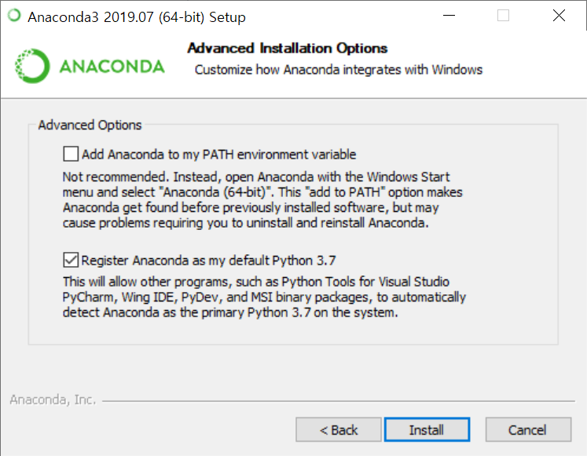

**07** 아나콘다를 설치합니다. `<Show detail>` 버튼을 누르면 자세한 설치 진행 상황을 확인할 수 있습니다. 사용자의 컴퓨터 성능에 따라 설치 시간은 차이가 있습니다. 보통 10분 이상의 시간이 걸릴 수 있으니 기다리기 바랍니다.

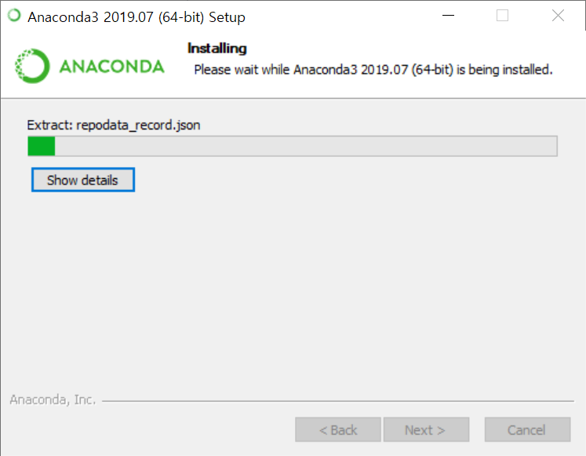

**08** 설치를 완료하면 `<Next>` 버튼을 누릅니다.

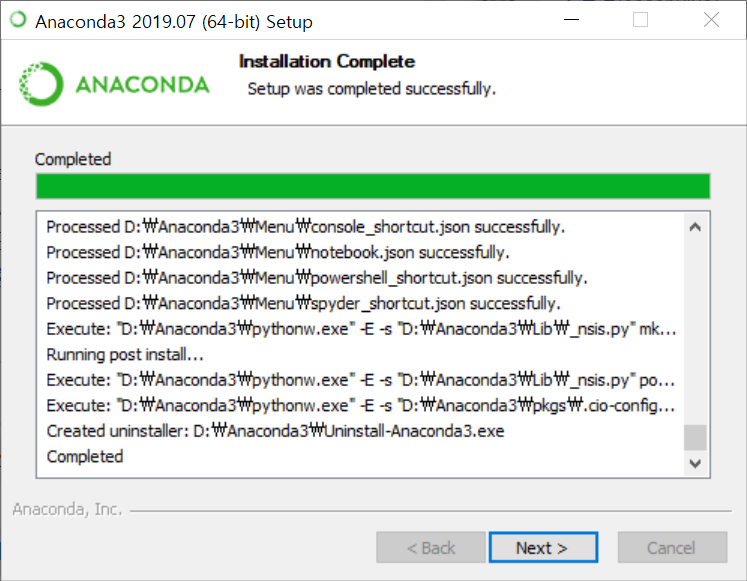

**09** 아나콘다는 제트브레인(JetBrain)에서 만든 파이참(PyCharm)이라는 파이썬 개발 도구와의 편의성을 제공하므로 설치할 것인지 묻습니다. 만약 설치하려면 해당 창에 있는 주소인 [https://www.anaconda.com/pycharm](https://www.anaconda.com/pycharm)에 접속해 설치하면 됩니다. 설치하지 않으려면 `<Next>` 버튼을 누릅니다.

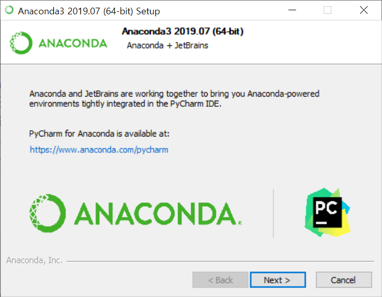

**10** 아나콘다 설치를 완료했습니다. 아나콘다는 노트북, 패키지, 프로젝트, 개발 환경을 공유하는 아나콘다 클라우드를 제공한다고 소개합니다. 아나콘다 클라우드를 사용하고 싶다면 `[Learn more about Anaconda Cloud]`를 선택합니다. 아나콘다를 처음 사용할 때의 사용 방법을 확인하려면 `[Learn how to get started with Anaconda]`를 선택합니다. 필요한 항목을 선택했다면 `<Finish>` 버튼을 눌러 설치를 마칩니다.

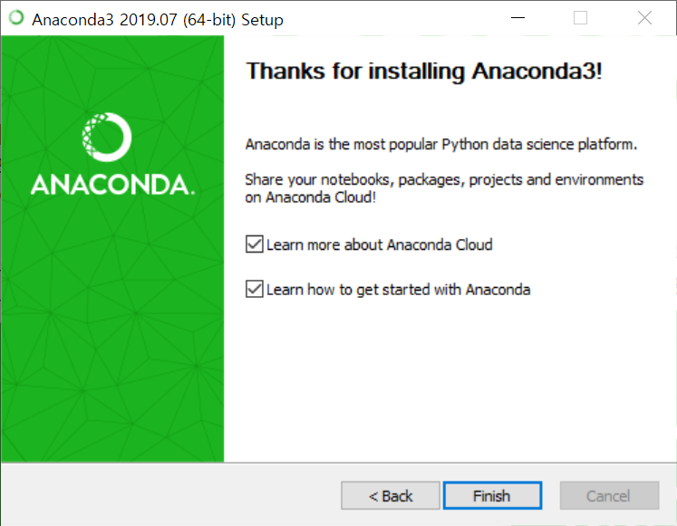

## macOS
**01** [Anaconda 연도.숫자 for macOS Installer](https://www.anaconda.com/distribution/#download-section)에 접속합니다. 왼쪽 `[Python 3.x version]`에 있는 `<download>`를 눌러 아나콘다 설치 파일을 다운로드합니다.

64비트 설치 파일을 사용한다면 `[64-bit Graphical Installer]`를 선택해 다운로드해도 괜찮습니다. 터미널에서 아나콘다를 설치한다면 `[64-bit Command Line Installer]`를 선택해 다운로드해도 괜찮습니다.

**02** 다운로드한 Anaconda3-연도.숫자-MacOSX-x86_64.pkg 파일을 실행합니다. "이 패키지는 소프트웨어 설치가 가능한지 결정하는 프로그램을 실행합니다."가 등장하면 `<계속>` 버튼을 눌러 설치를 계속 진행합니다.

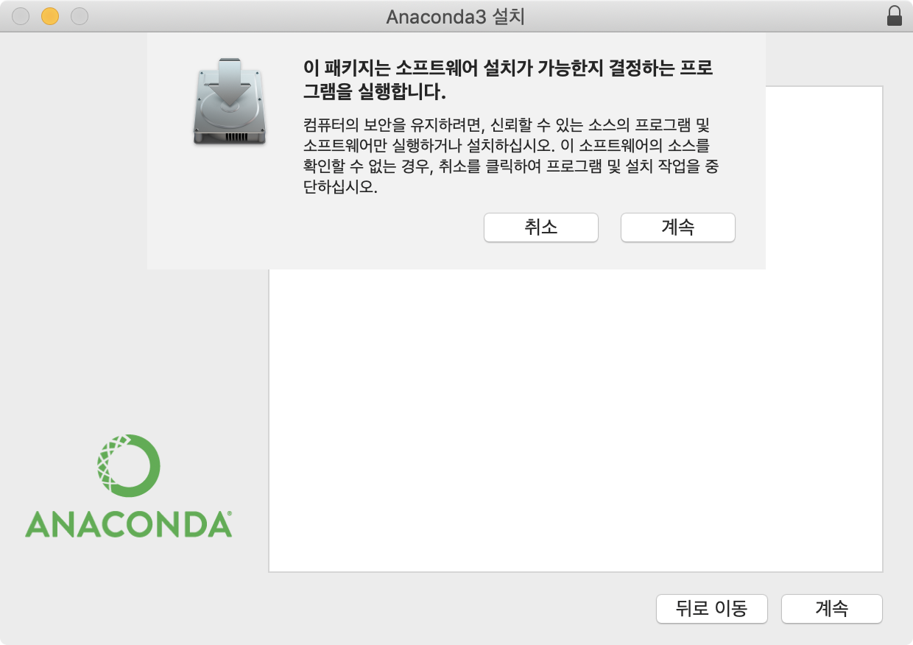

이어서 `[소개]` 창이 등장합니다. `<계속>` 버튼을 누릅니다.

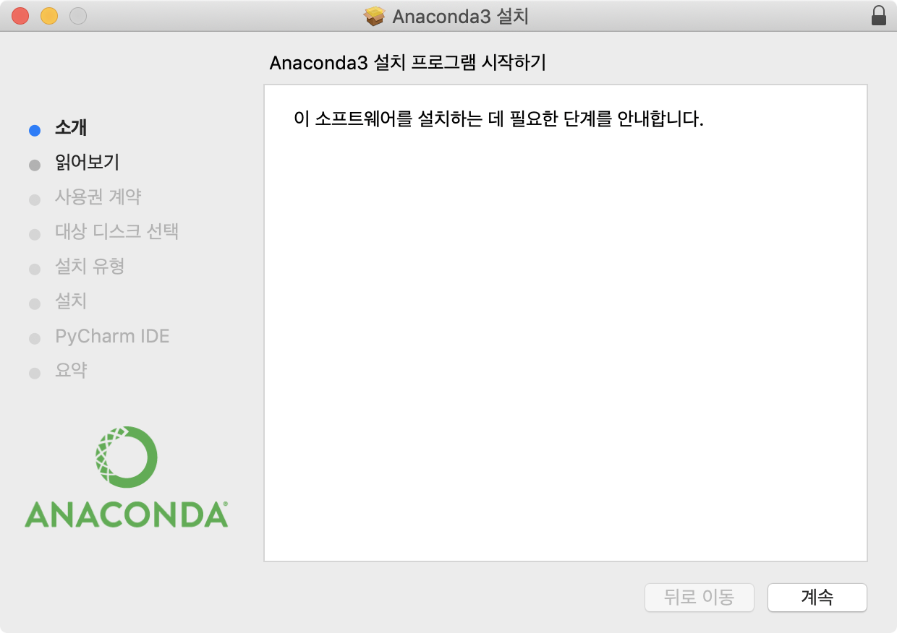

**03** `[읽어보기]`는 아나콘다를 설치할 때의 중요 정보를 보여줍니다. 또한 현재 아나콘다 설치 파일 안 주요 패키지 정보도 알려줍니다. 시간이 된다면 스크롤창에 있는 아나콘다 라이선스 조항을 읽어보기 바랍니다. 해당 내용을 프린트하려면 `<프린트>` 버튼을 누르고 PDF로 저장하려면 `<저장>` 버튼을 누릅니다. 설치를 계속 진행하려면 `<계속>` 버튼을 누릅니다.

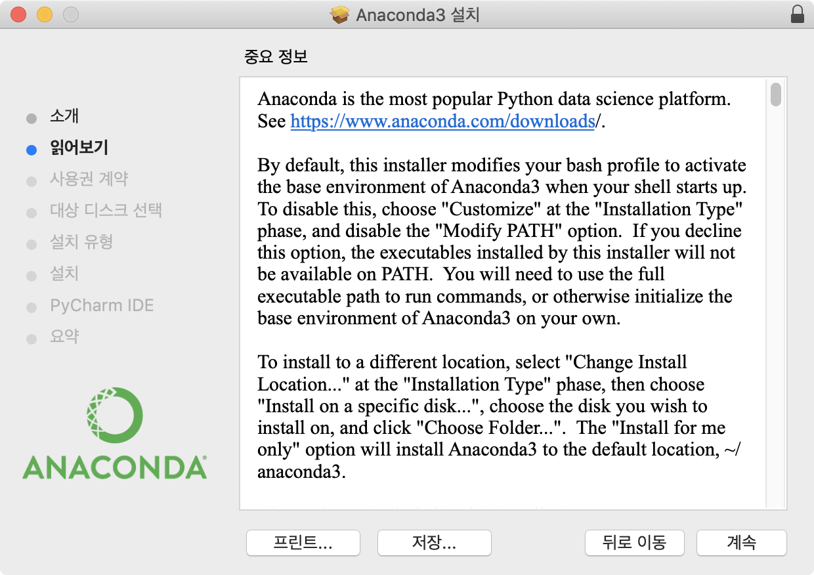

**04** `[사용권 계약]`은 아나콘다의 라이선스 조항에 동의할 것이냐는 내용입니다. 당연히 해당 조항에 동의해야 아나콘다를 사용할 수 있습니다. 시간이 된다면 스크롤창에 있는 아나콘다 라이선스 조항을 읽어보기 바랍니다.

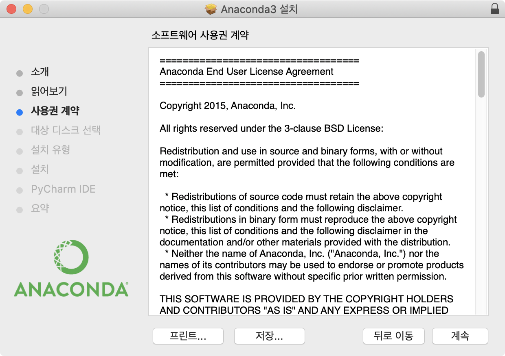

`<계속>` 버튼을 누르면 소프트웨어 사용권 계약의 이용 약관에 동의하는 창이 등장합니다. `<동의>` 버튼을 누릅니다. `<사용권 계약 읽기>` 버튼을 누르면 이전 화면으로 돌아갑니다.
 
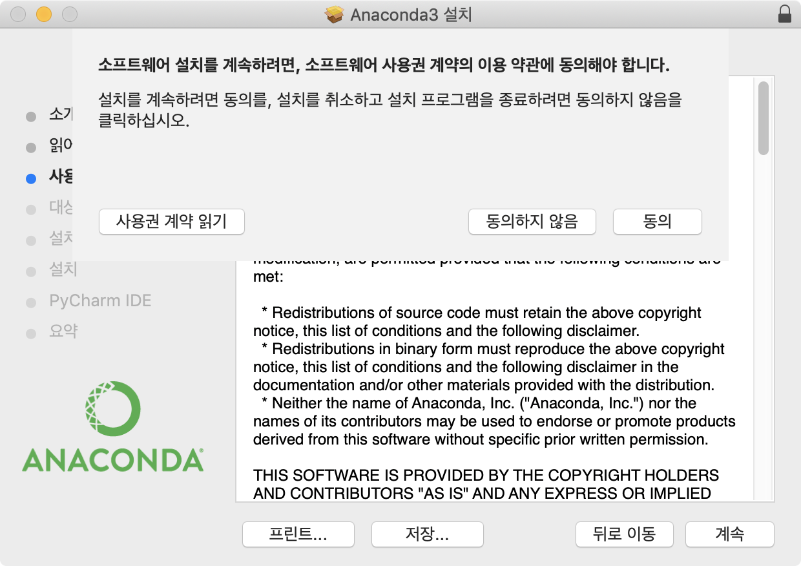

**05** `[대상 디스크 선택]`은 건너뛰고 자동으로 현재 사용자의 macOS가 설치된 디스크를 선택합니다. 이어서 `[설치 유형]`으로 이동하면 크게 두 가지 항목에서 설치 옵션을 선택할 수 있습니다.

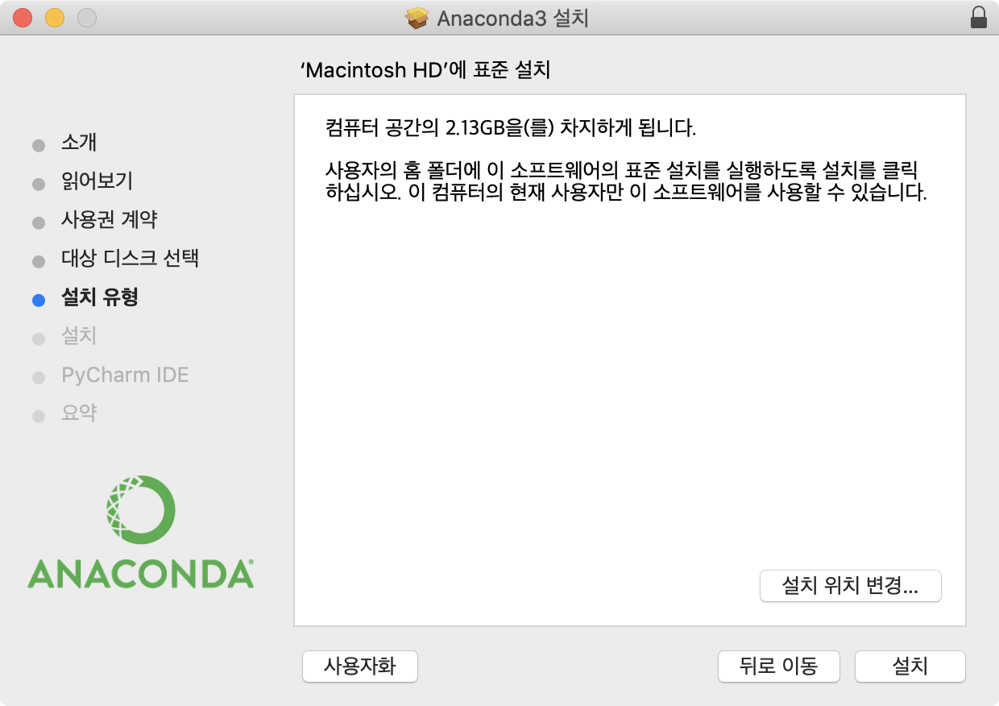

**06** `<사용자화>` 버튼을 누르면 `[Modify PATH]` 항목을 선택할 수 있습니다. 이는 터미널을 실행했을 때 어떤 디렉터리에서든 아나콘다 명령을 실행하도록 설정하는 것입니다. 여기에서는 선택합니다. 대상 디스크를 선택하는 **07** 과정을 실행하려면 `<표준 설치>` 버튼을 눌러 **05** 과정으로 돌아갑니다. 현재 macOS가 설치된 디스크에 아나콘다를 바로 설치하려면 `<설치>` 버튼을 누릅니다.

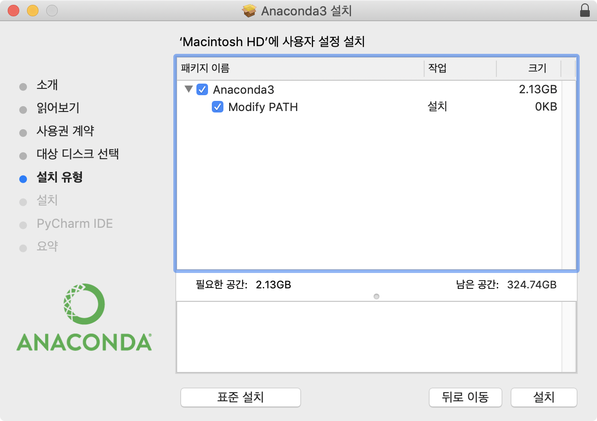

**07** 다시 **05** 과정으로 돌아와 `<설치 위치 변경>` 버튼을 누르면 `[대상 디스크 선택]` 항목으로 들어갑니다. 여기에서 macOS가 설치된 디스크 이외에 다른 디스크를 선택해 아나콘다를 설치하려면 `[특정 디스크에 설치]`를 선택합니다.

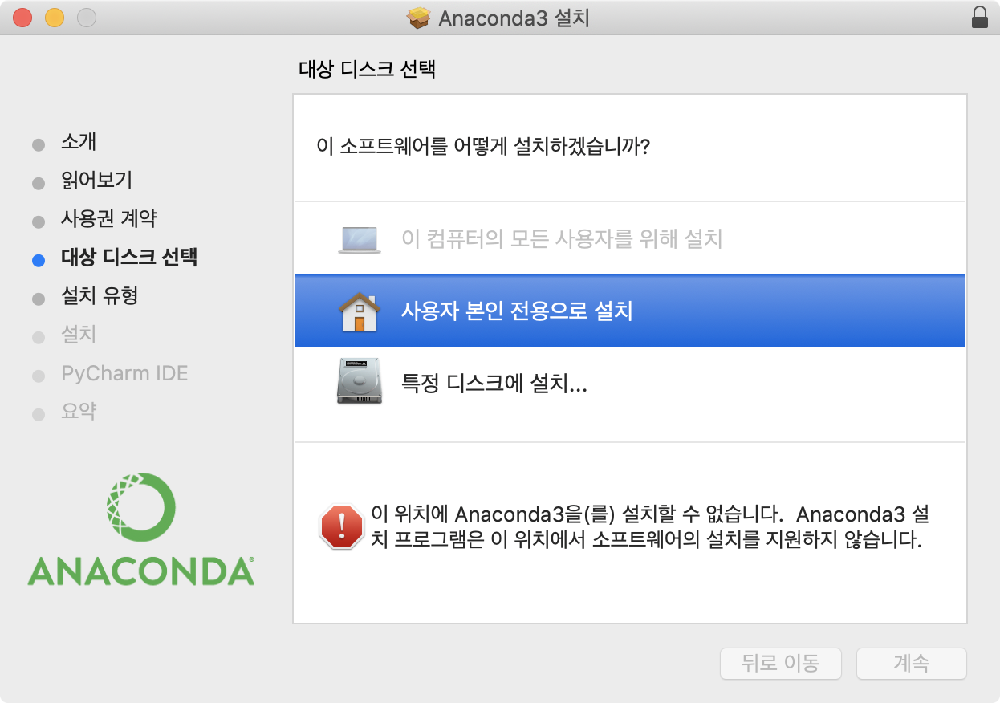

`[특정 디스크에 설치]`에서는 사용자가 원하는 디스크를 선택할 수 있습니다. 디스크를 선택한 후 아래에 있는 `<폴더 선택>` 버튼을 누릅니다.

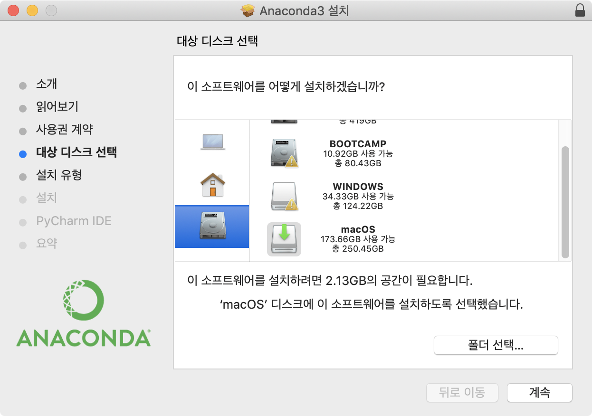

원하는 디스크의 폴더를 선택할 수 있는 창이 열리면 원하는 위치에 'anaconda3'라는 새 폴더를 생성한 후 `<선택>` 버튼을 누릅니다.

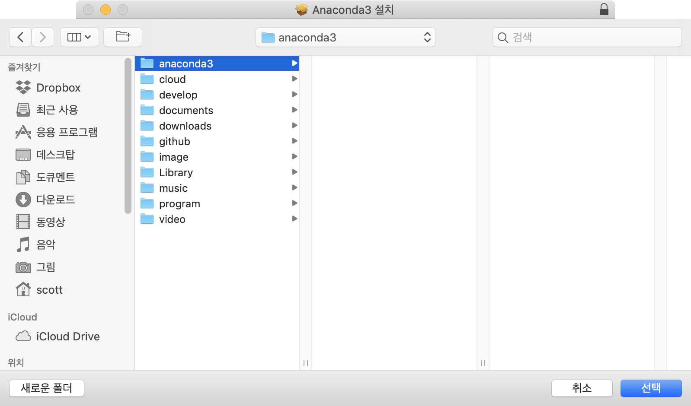

다시 `[특정 디스크에 설치]` 창으로 돌아오면 `<계속>` 버튼을 누릅니다. **05** 과정으로 돌아오면 `<설치>` 버튼을 누릅니다.

**08** 본격적으로 설치하기 전 "설치 프로그램이(가) 새로운 소프트웨어를 설치하려고 합니다"라는 메시지가 등장합니다. `[사용자 이름]`이 여러분이 로그인한 macOS 사용자 계정 이름인지 확인하고 혹시 아니라면 해당 이름으로 수정합니다. `[암호]`에는 로그인 암호를 입력한 후 `<소프트웨어 설치>` 버튼을 누릅니다.

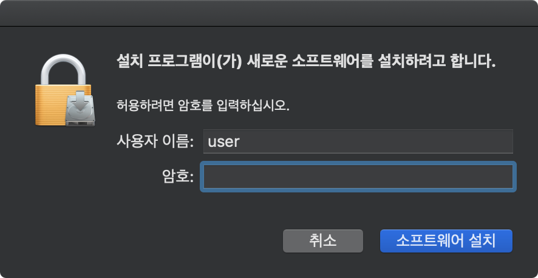

터치바 기반의 맥북 프로를 사용한다면 지문을 입력해서 바로 설치할 수도 있습니다.

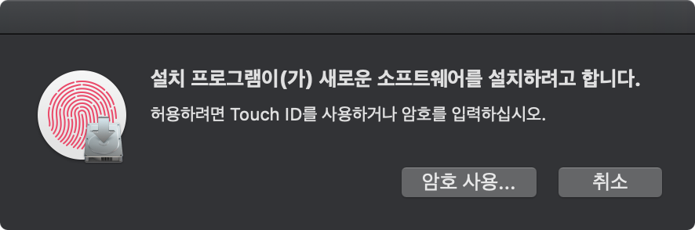

**09** `[설치]`에서 아나콘다를 설치합니다. 사용자의 컴퓨터 성능에 따라 설치 시간은 차이가 있습니다. 보통 10분 이상의 시간이 걸릴 수 있으니 기다리기 바랍니다.

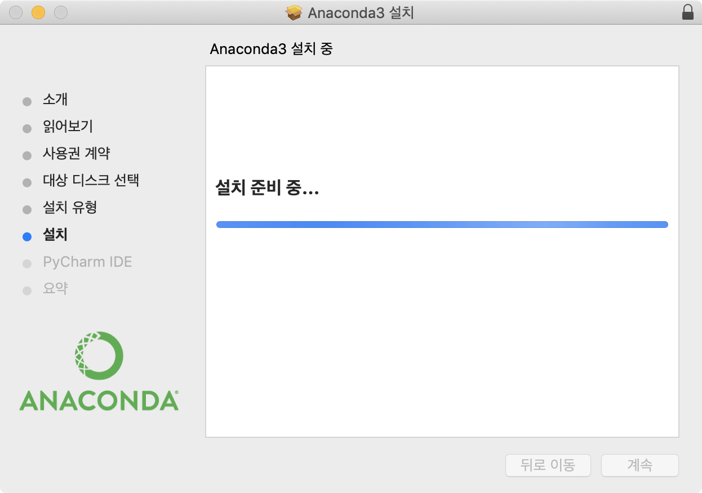

**10** `[PyCharm IDE]`에서는 제트브레인(JetBrain)에서 만든 파이참(PyCharm)이라는 파이썬 개발 도구를 설치할 것인지 묻습니다. 만약 설치하려면 해당 창에 있는 주소인 [https://www.anaconda.com/pycharm](https://www.anaconda.com/pycharm)에 접속해 설치하면 됩니다. 설치하지 않으려면 `<계속>` 버튼을 누릅니다.

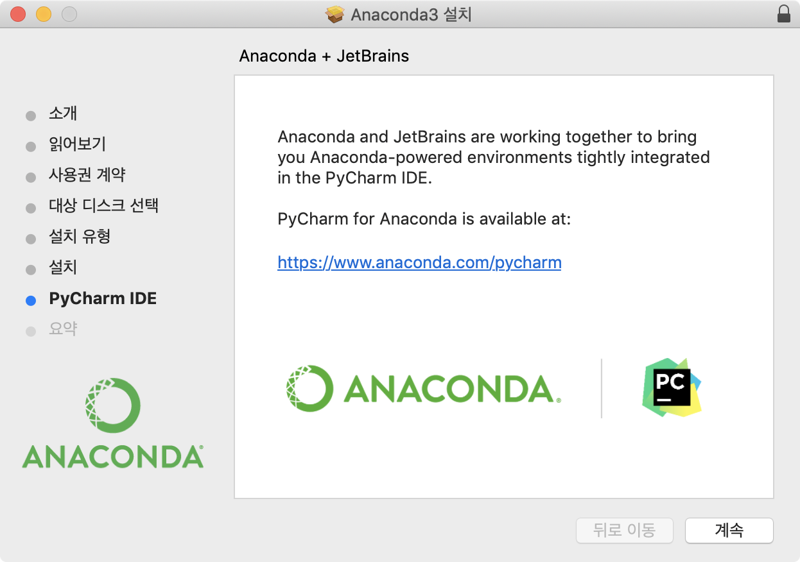

**12** 아나콘다 설치를 완료했습니다. 아나콘다는 노트북, 패키지, 프로젝트, 개발 환경을 공유하는 아나콘다 클라우드를 제공한다고 소개합니다. 아나콘다 클라우드를 사용하고 싶다면 `[Sign up for free]`를 선택합니다. 그렇지 않다면 `<닫기>` 버튼을 눌러 설치를 마칩니다.

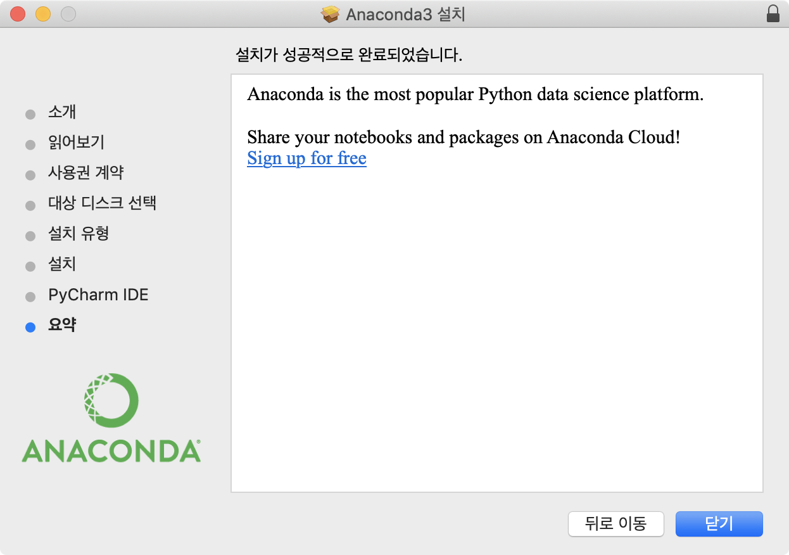

이후에는 다양한 웹 페이지나 서적을 참고해 아나콘다를 사용해보기 바랍니다.